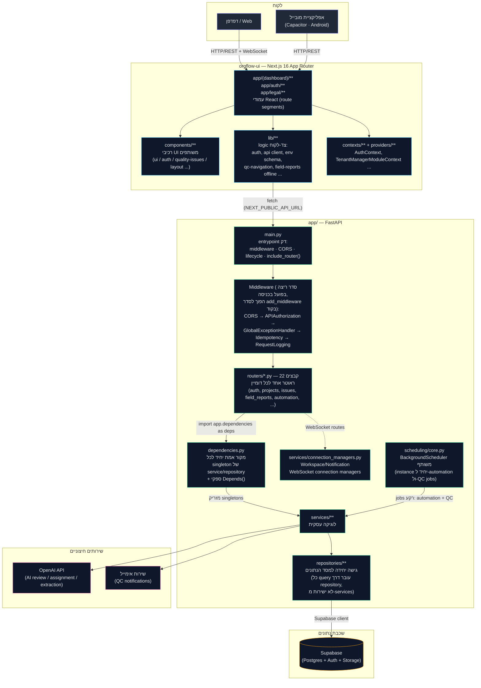

# ElayoAI (OrgFlow Agent)

One Stop Shop לניהול פרויקט בנייה — FastAPI + Next.js.

## מסמכי מקור

| מסמך | תפקיד |
|------|--------|
| [`docs/PRODUCT-SPEC-LOCKED.md`](docs/PRODUCT-SPEC-LOCKED.md) | מוצר נעול (מה/למה) |
| [`docs/FIELD-REPORT-FINALIZE-PIPELINE.md`](docs/FIELD-REPORT-FINALIZE-PIPELINE.md) | מימוש Finalize + PROGRESS (F1–F8 הושלם) |
| [`docs/COMPETITIVE-LAYER-SPEC.md`](docs/COMPETITIVE-LAYER-SPEC.md) | שכבת תחרות v2 — חזון (Zero Setup, V/X, Instant Loop) |
| [`docs/COMPETITIVE-LAYER-TASKS.md`](docs/COMPETITIVE-LAYER-TASKS.md) | **משימות לסוכן** — Z/V/L/R gates + PROGRESS |
| [`docs/FIELD-REPORT-CHECKLISTS.md`](docs/FIELD-REPORT-CHECKLISTS.md) | צ'קליסטים |
| [`docs/HANDOFF-AGENT-PROMPT.md`](docs/HANDOFF-AGENT-PROMPT.md) | handoff לסוכן |
| [`docs/PILOT-CHECKLIST.md`](docs/PILOT-CHECKLIST.md) | פיילוט שטח |
| [`docs/PROJECT-SUPERVISION-DASHBOARD-SPEC.md`](docs/PROJECT-SUPERVISION-DASHBOARD-SPEC.md) | דשבורד פרויקט למפקח — מפרט מוצר (זרימה, UI, חישוב ג) |
| [`docs/PROJECT-SUPERVISION-DASHBOARD-TASKS.md`](docs/PROJECT-SUPERVISION-DASHBOARD-TASKS.md) | **משימות לסוכן** — gates D1–D10 + PROGRESS |
| [`docs/ARCHITECTURE-REFACTOR-REPORT.md`](docs/ARCHITECTURE-REFACTOR-REPORT.md) | **דוח שינויים** — ריפקטורינג ארכיטקטוני מלא (2026-07), כל שלב, כל קובץ, כל בדיקה |

> קבצי ה-spec המקוריים (`PRODUCT-SPEC-LOCKED.md` ואחרים בטבלה) לא נשמרו בפועל
> ב-git עקב באג ב-`.gitignore` שתוקן ב-2026-07 — פירוט מלא ב-
> [`docs/README.md`](docs/README.md). אם עותק שלהם קיים אצל מישהו בצוות, כדאי
> להחזיר אותם לכאן.

## ארכיטקטורה

הפרויקט מורכב משני חלקים עצמאיים החולקים רק חוזה HTTP (REST + WebSocket):

- **Backend** — `app/` — FastAPI, Python 3.12, Supabase (Postgres) כמסד נתונים.
- **Frontend** — `orgflow-ui/` — Next.js 16 (App Router), React 19, גם כאתר וגם
  כאפליקציית מובייל (Capacitor/Android).

מבנה ה-backend עבר ריפקטורינג ארכיטקטוני מלא ביולי 2026 (ראו
[`docs/ARCHITECTURE-REFACTOR-REPORT.md`](docs/ARCHITECTURE-REFACTOR-REPORT.md)):
קובץ `app/main.py` היה בעבר מונוליט בן כ-8,100 שורות שהכיל את כל ה-routes, כל
ה-services וכל מודלי ה-request; היום הוא "entrypoint" דק בן כ-250 שורות
בלבד, וכל השאר מפוצל למודולים ממוקדים לפי אחריות יחידה (Single
Responsibility).

### מפת זרימה מלאה



**קריאה מודרכת של הזרימה:**

1. בקשה יוצאת מהדפדפן או מהאפליקציה, עוברת דרך `lib/api/client.ts`
   (frontend) אל כתובת ה-API (`NEXT_PUBLIC_API_URL`, מאומתת ב-
   `lib/env/schema.ts`).
2. ב-backend הבקשה נכנסת דרך `app/main.py` ועוברת שרשרת middleware קבועה. חשוב:
   Starlette מפעיל middleware בסדר **הפוך** לסדר קריאות ה-`add_middleware()`
   בקוד (האחרון שנרשם הוא החיצוני ביותר) — כך שסדר הריצה בפועל על בקשה
   נכנסת הוא: CORS → הרשאות API (`APIAuthorizationMiddleware`) → exception
   handler גלובלי → idempotency (למניעת כפילויות בבקשות כתיבה) → לוגים,
   ורק אז ה-routing עצמו.
3. FastAPI מנתב את הבקשה לפי path prefix לאחד מ-22 קבצי ה-router
   ב-`app/routers/`, שכל אחד מהם אחראי על דומיין יחיד (למשל `projects.py`,
   `issues.py`, `field_reports.py`).
4. כל route מזריק את ה-services שהוא צריך דרך `app.dependencies` (מקור
   אמת יחיד ל-singletons — לא הגדרות כפולות).
5. שכבת ה-services מכילה את הלוגיקה העסקית, וניגשת למסד הנתונים **רק**
   דרך שכבת ה-repositories (אף service לא מחזיק חיבור ישיר ל-Supabase
   מלבד `user_management_service.py`, שמוגדר כחריג מתועד — הוא עושה שימוש
   ב-Supabase Auth Admin API בלבד, לא בשאילתות טבלה).
6. עדכוני real-time (WorkspaceConnectionManager / NotificationConnectionManager)
   ו-jobים ברקע (automation + QC, דרך `scheduling/core.py`) פועלים
   באותה שכבת services.

### עץ קבצים — Backend (`app/`)

```
app/
├── main.py                  # entrypoint: middleware, CORS, lifecycle, include_router() × 22
├── dependencies.py          # מקור אמת יחיד: כל singleton של service/repository + Depends() providers
├── routers/                 # 22 קבצים — ראוטר אחד לכל דומיין (actions, admin, auth, projects, issues, ...)
├── schemas/
│   ├── api_requests.py      # כל מודלי ה-Pydantic request/response המשותפים
│   └── *.py                 # סכמות ייעודיות לדומיין (quality_issue, field_reports, ...)
├── services/                # לוגיקה עסקית — 265 קבצים, קובץ אחד לדומיין/יכולת
│   └── connection_managers.py   # WebSocket connection managers (Workspace / Notification)
├── repositories/            # שכבת גישה יחידה למסד הנתונים — 35 repositories
│   └── generic_table_repository.py  # ל-services שצריכים גישה גנרית לטבלה דינמית (מחיקות מדורגות וכו')
├── scheduling/
│   └── core.py              # instance יחיד של BackgroundScheduler (משותף ל-automation ול-QC jobs)
├── auth/                    # middleware הרשאות, JWT, roles, permission matrix
├── config/                  # settings.py (מקור אמת ל-env vars), feature flags, seeds
├── exceptions/               # exception handler גלובלי, logging setup
├── automation/, jobs/        # רישום jobs ל-scheduler
├── agent/, ai/, prompts/     # שכבת AI (LLM adapter, providers, orchestration)
├── lib/                      # helpers טהורים (validation, aggregation) ללא תלות ב-DB
├── integrations/             # אינטגרציות חיצוניות (Google, email וכו')
├── tools/                    # tools ל-agent
├── models/, data/, db/       # מודלים גולמיים, seed data, חיבור Supabase
└── constants/
```

### עץ קבצים — Frontend (`orgflow-ui/`)

```
orgflow-ui/
├── app/                      # Next.js App Router — route segments בלבד
│   ├── (dashboard)/          # כל עמודי הדשבורד המאובטחים (projects, issues, automation, ...)
│   ├── auth/                 # login, callback, set-password
│   └── legal/[slug]/         # terms, privacy, ai-transparency
├── components/                # רכיבי UI משותפים, לפי דומיין
│   ├── ui/                   # רכיבי בסיס (Button, Card, Badge, ...) — כל הקבצים PascalCase
│   ├── auth/, quality-issues/, layout/  # רכיבים ייעודיים לדומיין
│   └── layout/Sidebar.tsx, ProjectTabs.tsx  # chrome/ניווט (הועבר מ-app/components/ ב-2026-07)
├── lib/                       # לוגיקה טהורה + אינטגרציות צד-לקוח
│   ├── env/schema.ts          # ולידציית zod לכל משתני הסביבה הציבוריים
│   ├── env/public-env.ts      # API ציבורי (getApiBaseUrl, isSupabaseConfigured, ...)
│   ├── api/                   # HTTP client
│   ├── auth/                  # route guards, persistence
│   ├── tenant-manager-module/ # אירועי "מודול מנהל שוכרים" (שם עקבי לפיצ'ר, לא tenancy כללי)
│   └── field-reports/, quality-issues/, projects/, ...
├── contexts/, providers/      # React context (Auth, TenantManagerModule, ...)
├── hooks/                     # custom hooks
├── tests/
│   ├── lib/**                 # בדיקות לוגיקה טהורה (environment: node)
│   ├── components/**           # בדיקות רכיבי React (environment: jsdom, ראו Button.test.tsx)
│   └── setup.ts                # jest-dom matchers
├── android/                   # Capacitor Android project
├── scripts/                   # build-mobile-export, capacitor-stub-web, apk build
└── public/, styles/, types/
```

## Run locally

```bash
python3 -m venv .venv
source .venv/bin/activate
pip install -r requirements.txt -c constraints.txt
cp .env.example .env   # למלא ערכים אמיתיים
uvicorn app.main:app --reload
```

הפרויקט נעול ל-Python 3.12 (`.python-version`). רשימת משתני הסביבה המלאה,
עם הסברים, נמצאת ב-`.env.example` — המקור הקנוני לערכים ולברירות המחדל הוא
`app/config/settings.py`.

## Frontend development

```bash
cd orgflow-ui
npm install
npm run dev
```

In `orgflow-ui/.env.local` you can control the auth behavior for local development:

- `NEXT_PUBLIC_API_URL` should point to the backend, e.g. `http://127.0.0.1:8000`
- `NEXT_PUBLIC_FORCE_LOGIN=false` - in the browser, auth is stored per tab (`sessionStorage`) and ends when the tab is closed; reopening the app shows the public home page until you sign in again
- `NEXT_PUBLIC_FORCE_LOGIN=true` forces sign-out on every page load (including refresh), for stricter local testing

### בדיקות

```bash
# Backend
pytest

# Frontend
cd orgflow-ui
npm test           # vitest run — tests/lib/** (node) + tests/components/** (jsdom)
```
